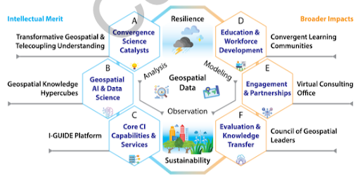
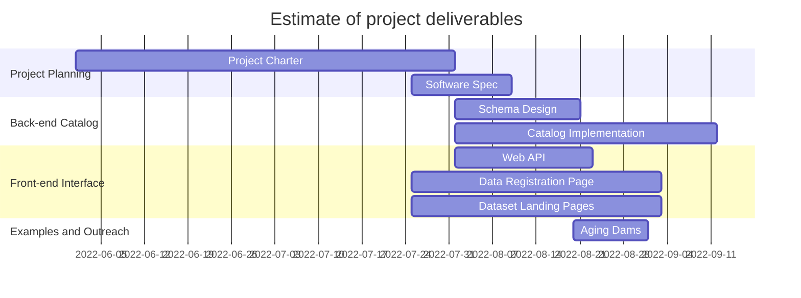

# iGUIDE Data Catalog
## Project Charter/Plan

### 1. Summary

To support convergence science, I-GUIDE will apply novel transdisciplinary
approaches that bring three scientific paradigms – analysis, modeling, and
observation – under one convergence umbrella implemented through a
cyberinfrastructure (CI) platform (I-GUIDE platform) comprising core CI
capabilities and services (Fig.1: C). As an integrative discovery
environment, this platform will support collaborative research, and
computation- and data-intensive geospatial problem solving through:

1. a well-defined set of computational and data objects and services and
   intelligent ways of combining them in coupled analytics and models, and

2. accessible and interoperable ways to add new data or computation objects and
   services, and to allocate advanced CI resources and services at both local
   and national levels (e.g., NSF XSEDE).

The shared and user-centric environment, containing a rich set of highly
interactive and composable components for geospatial synthesis, will facilitate
the use of the I-GUIDE platform by diverse scientists and communities.

**Figure 1:** I-GUIDE's vision and major outcomes

Computational, domain-specific models are feasible at multiple spatio-temporal
scales and require and produce large geospatial datasets. Open data portals and
services for storing, managing, collaborating around, and sharing these large
datasets (e.g., GeoEDF, HydroShare, IPUMS, and Unidata) are also available from
a variety of scientific communities. However, integrating and analyzing these
varied data sources with domain-specific models is often difficult and time
consuming. I-GUIDE will directly tackle such challenges to solve a suite of
convergent scientific problems through geospatial synthesis across
computational, data, and model domains based on geospatial artificial
intelligence (AI), data science approaches, and advanced CI.

Central to the I-GUIDE mission is harnessing the vast, diverse and distributed
geospatial and temporal data at different scales and making them accessible and
usable to convergence research and education. The I-GUIDE platform will thus
provide core CI capabilities and services for data preparation, improvements in
model and data interoperability and workflows, and support education and
workforce training in data and CI literacies. The I-GUIDE platform will
comprise composable and interoperable tools and CI resources integrated through
service APIs and information exchange standards. An I-GUIDE science gateway
will allow users to find, explore, and share data, models, and code, with
access to software, hosted services, computational resources and learning
materials.

One of the goals of the Core CI Capabilities and Services team is to facilitate
access to diverse and distributed geospatial and temporal data at different
scales so they can be used for research and education.  This can be summarized
as facilitating access between the I-GUIDE team (researchers and students) and
publicly available data, as well as facilitating access to data created by
other team members.

While it’s desirable to leverage existing solutions wherever possible, we
recognize the need to develop solutions where technological gaps exist.  The
I-GUIDE CI team identified the need for a centralized catalog capable of
indexing the diverse, distributed data required by the project focus areas. The
catalog will need to be flexible enough to provide the following functionality:

1. Catalog resources using a variety of scientific data formats (e.g. *.nc,
   .csv,* .shp, etc) from a wide spectrum of scientific disciplines.
2. Reference existing community catalogs wherever applicable.
3. Clearly match available data with relevant community data/web standards
   (e.g. OGC WFS, REST, OpenDAP, etc.) or models and workflows with appropriate
   cloud computing tools.
4. Interoperate with community data repositories.

We envision that at a high level, the I-GUIDE catalog will be subdivided into
two components; frontend and backend. The responsibility of the frontend
component will be to provide an intuitive, searchable, user interface for the
catalog holdings. In contrast, the backend component will be solely responsible
for cataloging metadata and enabling access to the data holdings through well
described metadata.

### 2. Goals and Objectives

This section outlines the high level goals of the I-GUIDE catalog that are
crucial for success.

**Goal:** Facilitate discovery and access of a wide range of scientific content
via catalog metadata. This includes, but is not limited to, large gridded data,
point observations, remotely sensed data, scientific workflows, software tools,
and web resources such as learning modules.

**Objective 1:** Establish an open source and publicly accessible catalog that
will enable the discovery of community contributed spatio-temporal datasets and
related tools.

- We envision that at a high level, the I-GUIDE catalog will be subdivided
      into two components; frontend and backend. The responsibility of the
      frontend component will be to provide an intuitive, searchable, user
      interface for the catalog holdings. In contrast, the backend component
      will serve and maintain catalog metadata and enable access to the data
      holdings through well described metadata.

- Support the inclusion (and exclusion) of additional metadata records
      created by and/or recommended by the IGUIDE community.

**Objective 2:** No empty promises! If we advertise a resource in the catalog
then it must exist and be accessible.
    
- This limits catalog metadata holdings to data(sets) that we are confident
      won’t disappear, e.g. data hosted by the I-GUIDE project, federal
      institutions, universities, published in domain repositories, etc.

**Objective 3:** Enable both I-GUIDE team members and the broader scientific
community to discover publicly available, community resources both
programmatically and via web interface.

- Through this discovery mechanism, users will be given sufficient metadata
      to evaluate if the resource is what they need as well as how to access
      the resource, along with any relevant tools/resources/documentation
      (Kepler, Pegasus, notebooks, scripts,), cloud/web services (processing
      services, JupyterHub), scientific models (physics models, AI models), and
      scientific software containers.

**Objective 4:**  Provide guidance for common usage patterns and well known
datasets.

- This guidance may come in one or many forms and should cover a range of
      topics and references/links to instructional resources to assist with
      data access.

### 3. Scope of Work

This section outlines the work necessary to establish the initial I-GUIDE Data
Catalog. Efforts will focus, whenever possible, on generic software and CI
solutions that can be extended and/or adapted to meet the requirements of
future (and unknown) data holdings. Given the wide range of data used by the
I-GUIDE team, the **initial design will be tested using
spatiotemporal-geographic data.**

The purpose of this project is to establish the core catalog functionality
which is limited to:

1. A backend catalogs capable of holding a wide variety of spatiotemporal
   metadata.
2. A basic frontend web interface for browsing catalog holdings.
3. A small set of examples that demonstrate how metadata can be added, removed,
   edited, and consumed from the catalog.

**This project is complete when:**

1. The catalog (backend and frontend) have been deployed to the cloud.
2. Code examples have been created to demonstrate primary functionality.
3. Documentation has been developed to communicate the catalog’s capabilities
   and limitations.
4. Initial metadata have been ingested in the catalog, TBD.
5. The catalog has been integrated with the Core CI infrastructure led by Rajesh.
6. A maintenance plan has been devised.

#### 3.1. Exclusions

The following items are beyond the scope of this project

1. Soliciting and populating the catalog with data. The catalog will contain
   several meta-datasets to demonstrate its capabilities, however widespread
   solicitation is not part of the project.
2. Comprehensive web UI development. This project will establish a
   proof-of-concept web UI that will be extended/enhanced in subsequent work.
3. The cloud deployment will be on GCP and have limited capacity. A formal,
   long term, deployment will be addressed in subsequent work (not necessarily
   completed by this team).
4. Data referenced in the catalog will be stored in GCP and will serve as a
   prototype. This project will not address the storage needs of I-Guide. As
   such, catalog integration with external cloud providers (for data storage)
   is left for subsequent work.
5. Directly supporting scientific models, workflows, and other non-space/time
   datasets. This will be revisited later on (not necessarily by this team).
6. Crawling and ingesting data/metadata from external catalogs into the I-GUIDE
   catalog. In future work, we will explore integrating this work with external
   catalogs via the web interface.
7. Development of software libraries for querying and traversing the metadata
   catalog. This is left as an activity for future work.

### 4. Deliverables

- **Deliverable 1:** Project Planning 

    - 1.1:  Project Plan: A document that clearly articulates the vision, goals, and deliverables for the catalog project.
    - 1.2: Software Specification: A document outlining the technical solution.

- **Deliverable 2:** Backend Data Catalog
    - 2.1: Catalog Implementation: A cloud-hosted data catalog capable of supporting a wide range of scientific data.
    - 2.2: Web API: A public API for accessing catalog holdings.
    - 2.3: Cloud Deployment: Cloud deployment configuration that can be used as a template in future work.

- **Deliverable 3:** Frontend Interface
    - 3.1: Web rendering of catalog metadata: A simple cloud-hosted frontend discovery interface. The front-end interface will provide a demonstration for how catalog holdings can be navigated via web browser. 
    - 3.2: Catalog data submission interface: A simple mechanism to add, remove, and update items (and their respective metadata) from the catalog.
    - 3.3: Cloud deployment: Cloud deployment configuration that can be used as a template in future work.

- **Deliverable 4:** Examples and Outreach Content
    - 4.1: Programmatic examples that demonstrate how to query the data catalog
      and then retrieve spatio-temporal data.

- **Deliverable 5:** Final Report

### 5. Requirements

The following requirements must be met by the I-GUIDE Catalog to reach the
goals outlined above. For simplicity, requirements are grouped by deliverable.

#### Deliverable 1: Project Planning

1. A formal project plan (and software specification, if necessary) that has
   been approved by the Core CI team leads.

#### Deliverable 2: Back-end Catalog

1. Ability to catalog a wide variety of scientifically-relevant resource
   formats, including, but not limited to: UTF-8 text data (csv, tsv, etc.),
   multidimensional binary data (netcdf, hdf), geospatial data (geotiff, ,
   GeoJSON, GeoPackage), cloud native data (zarr, tiledb, parquet, cloud
   optimized geotiff (COG), flatgeobuf ).

    -  Initial work will provide demonstrable access to a subset of these
       formats; COG, NetCDF, Zarr, Flatgeobuf. Jupyter notebooks will be
       developed to validate that these formats are supported.

    -  Documentation will be provided for all formats that are not demonstrably
       tested within the software specification to show future steps to
       integrate them into the catalog.

2. Record rich metadata for catalog holdings that share common “core” fields
   (e.g., title, author, date created, format, etc.), as well as, content
   type/application specific fields (e.g., web services, data-application
   matching, etc.). These metadata must be sufficient to dynamically populate
   the frontend web user interface/web page, as well as enable free-text and
   faceted search capabilities. That is, the web user interface is populated
   directly from the catalog and does not require manual intervention.

3. Ability for users to discover relevant tools and services for data
   processing and analysis (e.g., data application matching). For example,
   after finding a holding of interest, the catalog should present the user
   with context relevant associated visualization, processing, or analysis
   services/tools that can be used with a particular dataset and/or cloud
   computing environments that are relevant.

4. Automated “health checks” to ensure that catalog holdings are accessible.
   This is necessary to meet Goal #2 “No empty promises”. In the event that a
   dataset is not accessible, its metadata will be updated to reflect this
   (which will also update the web UI) and an email notification will be sent
   to catalog maintainers and dataset owners.

#### Deliverable 3: Frontend Discovery

1. Catalog access/browsing by (1) a graphical web user interface and (2) via
   application programming interfaces (APIs). These two methods of access are
   necessary to enable discovery and access of datasets to support a wide range
   of use-cases.

2. Ability for users to submit (or request) new metadata holdings to include in
   the catalog via web user interface/web form.

3. Thorough metadata listings for all catalog holdings. While documentation
   will be specific to each item in the catalog, this may include information
   on data format, related tools, required web services, computing platforms,
   etc.

4. A mechanism for metadata holdings to be registered and curated by
   administrators and I-GUIDE researchers via a web user interface. This is
   necessary to enable the I-GUIDE team members to register new data(sets) to
   be indexed in the catalog.

### 6. Resources

#### 6.1 Team Members

- Tony C: Senior Research Hydrologist - CUAHSI
- Scott B: Senior Software Engineer - CUAHSI
- Austin R: Scientific Software Architect - CUAHSI
- Jeff H: Associate Professor - USU
- Pabitra D: Software Engineer - USU
- Drew L: Research Programmer - U. Illinois
- Rajesh K: Research Scientist - Purdue U.
- CI Team: I-GUIDE CI team members.

#### 6.2 Responsibilities

A RACI chart is used to communicate team member roles and responsibilities
within the project:

- Responsible: The team member(s) charged with doing the work to complete the
  task.
- Accountable: The team member who ensures that the work gets done and is
  charged with reviewing and accepting the task or deliverable.
- Consulted: The team member(s) who provide input and feedback on the work
  being done.
- Informed: The team member(s) who need to be kept in the loop but do not need
  to be consulted on every task.

|Activity| Tony | Austin | Scott | Jeff | Drew | Rajesh | CI Team |
|---|---|---|---|---|---|---|---|
|Project Planning|R/A|I|I|C|I|I|A|
|Design Doc|R/A|R|R|C|C|C|I|
|Back-end Prototype|A|R|C|C|I|I|I|
|Front-end Prototype|A|C|R|C|I|I|I|
|System Testing|A/R|I|I|C|R|R|R|
|Example Creation|A/R|I/C|I/C|I|I|I|I|

### 8. Project Timeline

