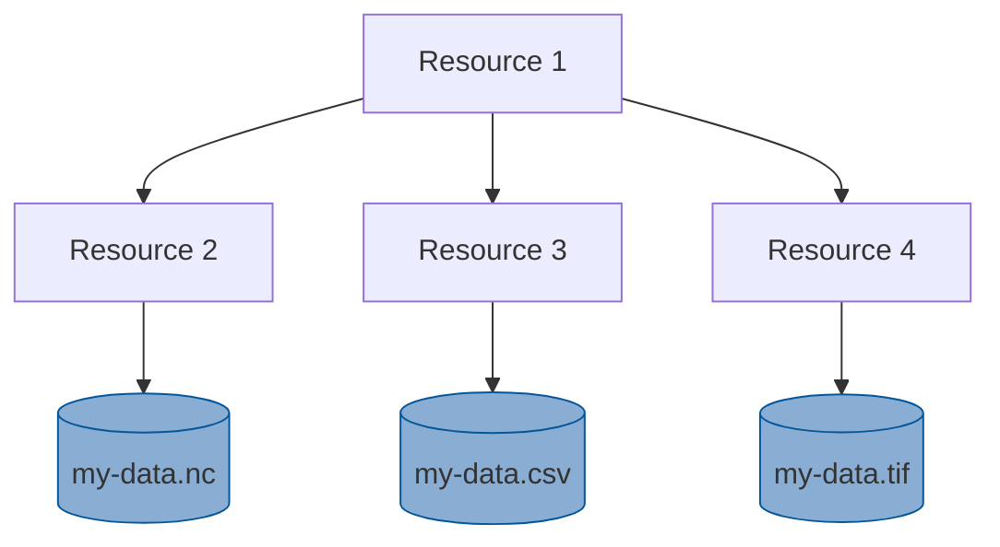

# Catalog Use Cases

The purpose of this document is to define use cases that the catalog and, more specifically, the catalog schema should be capable of satisfying.

## 1. Collection of Datasets
A collection of datasets occurs when one dataset references another (or many) dataset that is hosted independently. 
This can happen in a number of different ways, but in each instance there is a primary website or landing page that 
uses hyperlinks to reference a webpage that describes a different dataset. These referenced datasets can be expressed 
as "children" of the original. An example of this is a HydroShare collection resource in which a single web page references other HydroShare web pages that describe data. The way data is collected is similar to a folder that contains folders with data inside them:

**Scenario 1**: A scientist creates a HydroShare collection resource. Once metadata has been added to this resource, 
additional HydroShare resources are added to the collection. Each of the resources added to the collection contain 
their own metadata and contain data files. Metadata for the primary, collection, resource is expressed using Schema.org 
as well as the relationships with the "child" resources that exist in the collection. These relationships can be followed 
using references to discover additional metadata expressed on each of their landing pages.

**Scenario 2**: A scientist creates a web page that references various datasets that are stored in the cloud. These 
datasets appear as links on the web page and point to the source of the data files. Metadata for the primary, web page, resource 
is expressed using Schema.org as well as the relationships to each of the "child" datasets. These relationships can be followed 
via web url to access the data.
