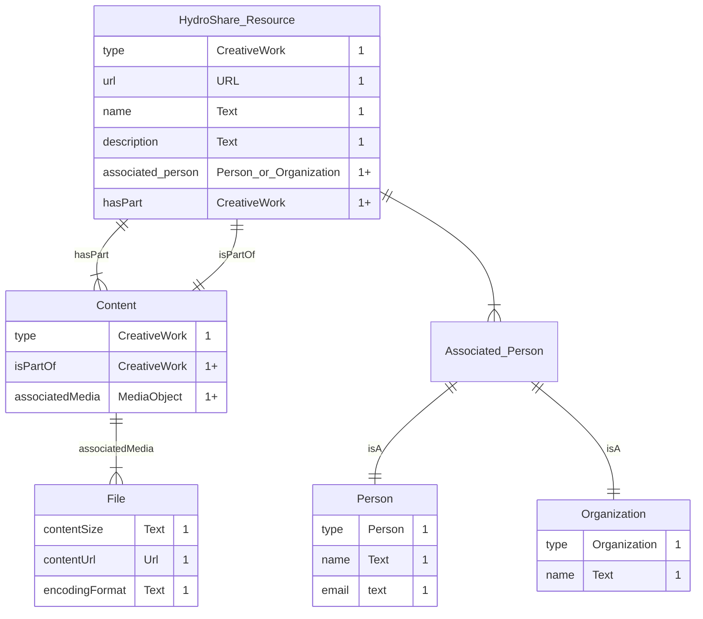

# Schema for a HydroShare Resource

The following is a graphical representation for expressing a HydroShare
resource using SchemaOrg terminology. In the example below, a
HydroShare resource is represented as a SchemaOrg CreativeWork that
contains content files represented as SchemaOrg CreativeWork(s).

### Notes
- **associated_person** can be one or more of the following elements:
`creator`, `author`, `owner`, `maintainer`, `producer`, `editor`.

# Database Representation of a HydroShare Resource

**TODO**

The following is a graphical representation of the HydroShare resource (above)
within a NoSQL database.

